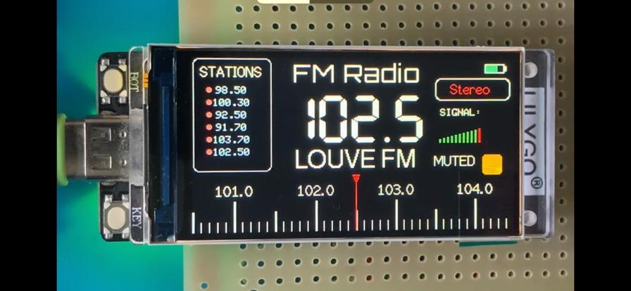

# TEmbedFMRadio sketch from Volos Projects ported to the Si473x.

This Si473x Radio uses the amazing library written by [PU2CLR (Ricardo Caratti)](https://github.com/pu2clr/SI4735). It is based on sketch from [Volos Projects](https://github.com/VolosR/TEmbedFMRadio). [Volos Projects](https://www.youtube.com/@VolosProjects) YouTube channel has a lot of tips and tricks for Lilygo T-Embed and Lilygo T-Display. I recommend this YouTube channel if you want to know more about this device and also about the tft_espi library, especially how to use sprites.

I am using a [Lilygo T-Display S3](https://github.com/Xinyuan-LilyGO/T-Display-S3), which is an ESP32S3 board with a 1.9 inch display with a 8-Bit Parallel Interface, but I believe it will also run on [Lilygo T-Embed](https://github.com/Xinyuan-LilyGO/T-Embed) by commentting out the line "#define I_use_T_Display_S3.

If you want just to look and feel the interface, it's also possible to run this sketch without Si473x. To do this, uncomment de line "#define SI4735_EMUL"

For now, my sketch only runs FM without RDS. On reset, all settings will return to default.

# Special instructions for the TFT_eSPI Library

It is extremely important to follow all the steps indicated on Lilygo github:

[Lilygo T-Display S3] (https://github.com/Xinyuan-LilyGO/T-Display-S3#quick-start)

[Lilygo T-Embed] (https://github.com/Xinyuan-LilyGO/T-Embed#quick-start)

# Releases

## [V0.2 - RDS Feature added]

 - RDS Feature added
 - Performance improvements

## [V0.1 - Initial Release]

First release. For now, FM only. On reset, all settings will return to default.

    This release implements different behaviors for different "press and hold" durations on its single button.
    
        - Single click:     Volume control. Another single click to return to the "frequency mode"
        - Double click:     Select stations from the list on the left.
        - Triple click:     Mute/Unmute.
        - Press and hold:   Set stations in the list on the left.

# Component Parts

* Si4732
* [Lilygo T-Display S3](https://github.com/Xinyuan-LilyGO/T-Display-S3)
* Rotary encoder with switch
* External Speaker (I use an old external Spearker)
* External Battery Pack
* Resistors/Capacitors/Wires

# Schematics:

* Si4735
Not avaliable yet

* Si4732

# Videos:

* https://youtu.be/G1P8UwrIhlU

# Pictures:

## Version V0.2

# References

1. [PU2CLR SI4735 Library for Arduino](https://github.com/pu2clr/SI4735)

2. [Volos Projects](https://github.com/VolosR/TEmbedFMRadio)

3. [Lilygo T-Display S3](https://github.com/Xinyuan-LilyGO/T-Display-S3)

4. [Lilygo T-Embed](https://github.com/Xinyuan-LilyGO/T-Embed)

# DISCLAMER

ATTENTION: The author of this project does not guarantee that procedures shown here will work in your development environment.
Given this, it is at your own risk to continue with the procedures suggested here.
